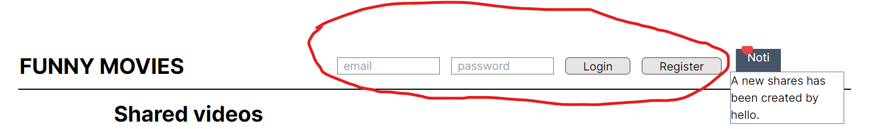
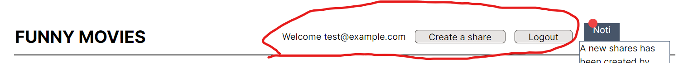
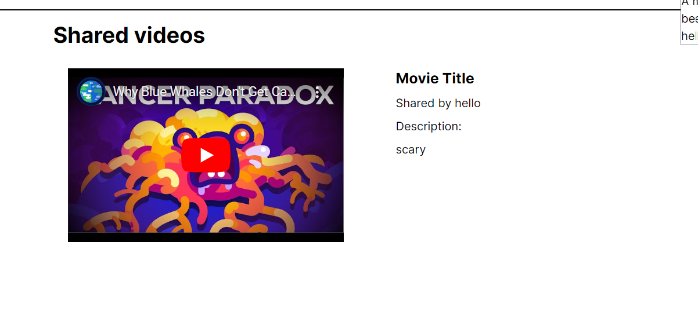

# Share Tube

## Description

- A simple application to allow people to share youtube video

## Key Feature

- User registration and login
- Create shares for YouTube videos
- Viewing a list of shared videos
- Notification of shared videos

## Pages available

- Homepage at `/` used to display shares
- ShareCreatePage at `/share` used to create new shares
- RegistrationPage at `/registration` used to register new user
  **Note there is also a header for user login and receiving notification at the top of the page**

## Pages Details

### Login Header

- Visible from all pages
- Includes:

#### User login/logout group

- When not logged in allow user to enter username and password and login or navigate to registration
  
- When logged in allow user to navigate to create share page or logout
  

#### Notification group

- Normally it doesn't do anything
- When a new shares is created the notification group will display message about a new video created
  

### Home Page

- Display a list of youtube video shared.
- **Note:** current the application only work correctly with youtube embedded link
- Only display the last 25 shares
- Mock title only. Share user, description and url is stored in db
  

### Registration Page

- Allow user to register into the system
- Only display mock error message
- Only have server side validation
- Logged user into the system and return to homepage when submit and register successfully
- Require all field to be filled
  

### Share create page

- Allow **registered** user to create new shares
- Redirect unregistered user to the homepage
- Only display mock error message
- Only have server side validation
- Successful creation will allow a notification message to be created
  
